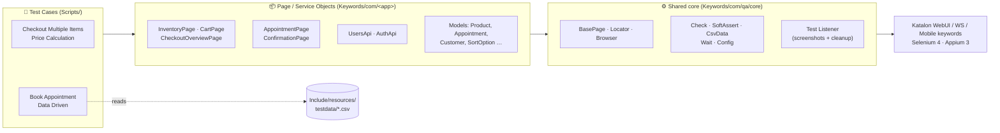
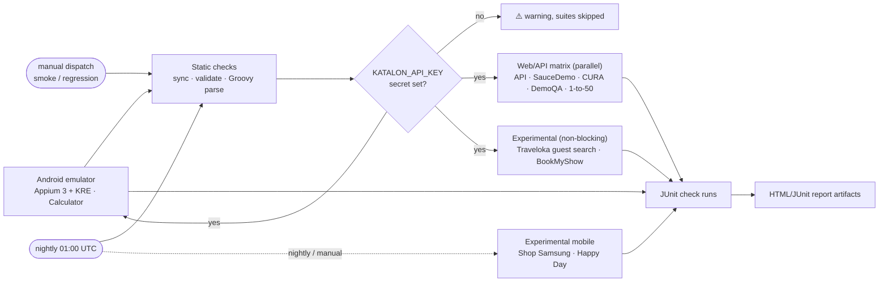

<div align="center">

# 🧪 Katalon Studio Automation Portfolio

**Web · API · Mobile test automation built on the Page Object Model, data-driven tests and GitHub Actions**

[](https://github.com/HivanA98/Katalon-Studio/actions/workflows/katalon-ci.yml)


[Quick start](#-quick-start) •
[Projects](#-projects-at-a-glance) •
[Architecture](#-architecture) •
[Write a test](#-write-a-new-test-in-5-steps) •
[CI/CD](#-continuous-integration) •
[Test catalogue](#-test-catalogue) •
[FAQ](#-troubleshooting--faq)

</div>

---

## 📌 Projects at a glance

| Project | Type | System under test | Runs in CI | Highlights |
|---|---|---|:---:|---|
| [`Web Testing/SauceDemo`](Web%20Testing/SauceDemo) | Web | [saucedemo.com](https://www.saucedemo.com) | ✅ | Price & tax math, sorting, cart state, data-driven negatives, cross-browser collection |
| [`Web Testing/HeroKuApp`](Web%20Testing/HeroKuApp) | Web | [CURA Healthcare](https://katalon-demo-cura.herokuapp.com) | ✅ | 13 copy-pasted scripts → **1 data-driven test**, history check, HTML5 validation |
| [`Web Testing/OpenQA`](Web%20Testing/OpenQA) | Web | [DemoQA](https://demoqa.com) | ✅ | Tri-state tree, mouse actions, **Web Tables CRUD**, ad removal |
| [`API`](API) | API | [ReqRes](https://reqres.in) | ✅ | Service objects, JSON contract checks, pagination walk, response-time budget |
| [`Web Testing/Traveloka test`](Web%20Testing/Traveloka%20test) | Web | zzzscore 1-to-50 · Traveloka | ✅ · 🧪 | 1-to-50 game; car-rental search **as a guest** (no login, no personal data) |
| [`Web Testing/BookMyShow`](Web%20Testing/BookMyShow) | Web | BigTix practice UAT (storefront + POS) | 🧪 | End-to-end purchase with gateway test cards |
| [`Mobile Test/*`](Mobile%20Test) | Android | Calculator · Shop Samsung · Happy Day | 📱 | Android emulator in CI; data-driven arithmetic incl. operator precedence |

> ✅ runs on every push and can fail the build · 🧪 runs in CI as *experimental* (third-party site or practice data, never fails the build) · 📱 runs on an Android emulator in CI (Calculator on every push, store apps nightly)

---

## 🚀 Quick start

<details open>
<summary><b>1. Prerequisites</b></summary>

| Tool | Version | Why |
|---|---|---|
| Katalon Studio / Runtime Engine | **11.5.0** or newer | Runs the projects (KRE 11 requires **OpenJDK 21**) |
| Python | 3.10+ | Repository tooling in [`tools/`](tools) |
| Chrome / Firefox | latest | Web projects (drivers are auto-updated) |
| Appium | 3.x | Mobile projects only |

</details>

<details open>
<summary><b>2. Open a project in Katalon Studio</b></summary>

Every folder that contains a `.prj` file is an independent Katalon project:

```text
File ▸ Open Project… ▸ Web Testing/SauceDemo/Sauce.prj
```

Then open **Test Suites ▸ Smoke** and press **Run ▸ Chrome**.

</details>

<details>
<summary><b>3. Run from the command line (Katalon Runtime Engine)</b></summary>

```bash
katalonc -noSplash -runMode=console \
  -projectPath="Web Testing/SauceDemo/Sauce.prj" \
  -testSuitePath="Test Suites/Regression" \
  -browserType="Chrome (headless)" \
  -executionProfile="default" \
  -apiKey="$KATALON_API_KEY" \
  --config -webui.autoUpdateDrivers=true
```

API suites use `-browserType="Web Service"`. Any profile variable can be overridden on the fly, e.g. `-g_timeout=30` or `-g_URL=https://staging.example.com/`.

</details>

<details>
<summary><b>4. Run the static checks locally (no Katalon licence needed)</b></summary>

```bash
python tools/validate_projects.py
```

```bash
python tools/sync_core.py --check
```

```bash
java -cp groovy-4.0.33.jar tools/GroovySyntaxCheck.java .
```

</details>

---

## 🏛 Architecture



**Design rules**

1. **Test cases describe behaviour, never locators.** They call page objects and assert with `Check` / `SoftAssert`.
2. **Page objects own their locators.** Public sites use readable CSS/XPath in code (`Locator.css('#checkout')`); private apps keep their recorded entities via `Locator.repo('…')`.
3. **Every interaction waits.** `BasePage` waits for visibility/clickability, so scripts contain no `delay()` calls.
4. **Navigation returns the next page.** `cart.checkout()` returns `CheckoutInformationPage`, which makes flows read like a user journey and lets the IDE autocomplete the next step.
5. **Data lives outside the code.** Profiles hold environment data, CSV files hold scenario data, models (`Customer`, `Appointment` …) hold structure.
6. **One source of truth for framework code.** [`shared/katalon-core`](shared/katalon-core) is synced into every project by `tools/sync_core.py`; CI fails if a copy drifts.

<details>
<summary><b>🔍 Anatomy of a page object</b></summary>

```groovy
class CartPage extends BasePage {

    final HeaderComponent header = new HeaderComponent()           // reusable component

    private final TestObject cartList       = Locator.css('.cart_list')
    private final TestObject itemNames      = Locator.css('.cart_item .inventory_item_name')
    private final TestObject checkoutButton = Locator.id('checkout')

    @Override
    protected TestObject pageMarker() { cartList }                 // used by verifyDisplayed()

    List<String> itemNames() { textsOf(itemNames, 2) }             // query

    CheckoutInformationPage checkout() {                           // navigation returns next page
        click(checkoutButton)
        CheckoutInformationPage next = new CheckoutInformationPage()
        next.verifyDisplayed()
        return next
    }
}
```

</details>

<details>
<summary><b>🔍 What a test case looks like</b></summary>

```groovy
CheckoutOverviewPage overview = LoginPage.open()
    .loginAs(User.STANDARD)
    .addToCart([Product.BACKPACK, Product.BIKE_LIGHT, Product.FLEECE_JACKET])
    .header.openCart()
    .checkout()
    .continueWith(Customer.fromProfile())

SoftAssert soft = new SoftAssert('Order summary')
soft.equal(overview.itemTotal(), expectedItemTotal, 'Item total = sum of product prices')
soft.equal(overview.tax(), expectedTax, 'Tax = 8% of item total')
soft.equal(overview.total(), expectedItemTotal + expectedTax, 'Total = item total + tax')
soft.assertAll()
```

</details>

<details>
<summary><b>🧰 Shared core reference</b></summary>

| Class | Purpose |
|---|---|
| `com.qa.core.web.BasePage` | Waiting `click`, `type` (React-safe clearing), `textOf`, `textsOf`, `selectByValue`, `jsClick`, `removeElements`, `verifyDisplayed()` |
| `com.qa.core.web.Locator` | `css`, `xpath`, `id`, `byText`, `repo`, safe XPath `literal()` |
| `com.qa.core.web.Browser` | Open with fixed viewport, navigate, reset session, screenshot, safe close |
| `com.qa.core.Check` | Hard assertions with readable messages (`equal`, `contains`, `matches`, `sorted`, `closeTo` …) |
| `com.qa.core.SoftAssert` | Collect failures and report them together |
| `com.qa.core.CsvData` | RFC-4180 CSV reader for data-driven tests (comments and `enabled` column supported) |
| `com.qa.core.Wait` | Polling `until {}` and `retry(n) {}` |
| `com.qa.core.Config` | Null-safe profile access with defaults (`Config.text('URL', '…')`) |
| `com.qa.core.Fixture` | Optional: git-ignored JSON fixtures with a committed `*.example.json` fallback |
| `com.qa.core.mobile.*` | `BaseScreen`, `MobileApp`, `MobileLocator` for Android |
| `Test Listeners/*TestListener` | Screenshot on failure, always close the browser/app, timing log |

</details>

---

## ✍️ Write a new test in 5 steps

- [ ] **Scaffold** the test case (creates the `.tc` descriptor with a fresh GUID and the script folder):
  ```bash
  python tools/katalon_scaffold.py testcase --project "Web Testing/SauceDemo" --id "Cart/Cart Survives Logout" --description "Cart content is kept after logging out and in again" --tag regression
  ```
- [ ] **Extend a page object** if the behaviour is new (add a locator + an intent-revealing method).
- [ ] **Write the script** using page objects and `Check` / `SoftAssert` only.
- [ ] **Add it to a suite**, or create one:
  ```bash
  python tools/katalon_scaffold.py suite --project "Web Testing/SauceDemo" --id "Cart" --cases "Cart/Add And Remove Items" "Cart/Cart Survives Logout"
  ```
- [ ] **Validate** before pushing:
  ```bash
  python tools/validate_projects.py --project "Web Testing/SauceDemo"
  ```

> 💡 Data-driven? Put rows in `Include/resources/testdata/<name>.csv` and loop over `CsvData.read('Include/resources/testdata/<name>.csv')` with a `SoftAssert`, as in *Login Negative Scenarios*.

---

## 🔁 Continuous integration



| Trigger | Suites |
|---|---|
| Push to `main`, pull request | **Smoke** of every web/API project, Traveloka guest search, BookMyShow, Android Calculator |
| Nightly schedule (Mon–Fri) | **Regression** of everything above **+** Shop Samsung and Happy Day on the emulator |
| *Actions ▸ Katalon CI ▸ Run workflow* | Choose `smoke` or `regression` (mobile store apps included) |

<details>
<summary><b>🧪 What "experimental" means</b></summary>

Some suites depend on things this repository does not control: Traveloka's bot protection, the BigTix practice UAT data (events from 2023), and 2022 store apps that call live back-ends. They still run and publish their reports, but a failure is shown as a warning instead of failing the build (`continue-on-error`). The Android Calculator job is also non-blocking until its first green run; then set `experimental: false` for it in [`katalon-ci.yml`](.github/workflows/katalon-ci.yml).

</details>

<details>
<summary><b>📱 How the Android job works</b></summary>

[`katalon-mobile.yml`](.github/workflows/katalon-mobile.yml) is a reusable workflow that enables KVM, installs **Appium 3 + UiAutomator2**, downloads and caches **Katalon Runtime Engine** for Linux, boots an **Android 13 (API 33) x86_64** emulator with [android-emulator-runner](https://github.com/ReactiveCircus/android-emulator-runner) and runs [`tools/ci/run-katalon-mobile.sh`](tools/ci/run-katalon-mobile.sh) (`-browserType="Android" -deviceId=<emulator>`).

</details>

<details open>
<summary><b>⚙️ One-time setup</b></summary>

1. Create a Katalon API key: **Katalon Platform ▸ Profile ▸ API Keys** (a Runtime Engine licence or trial is required for command-line execution).
2. In GitHub: **Settings ▸ Secrets and variables ▸ Actions ▸ New repository secret**
   - Name: `KATALON_API_KEY`
   - Value: *your key*
3. Push a commit, or run the workflow manually from the **Actions** tab.

Without the secret the static checks still run and the Katalon jobs finish with a warning, so forks and pull requests stay green.

</details>

<details>
<summary><b>📦 What the pipeline produces</b></summary>

- A **check run per project** with every test case (pass/fail, duration, failure message).
- An **artifact per project** (`katalon-report-<project>`) with Katalon's HTML/CSV/JUnit reports and failure screenshots.
- A **job summary** from the static validator listing test cases, suites, objects and keyword classes per project.

</details>

---

## 📚 Test catalogue

<details>
<summary><b>🛒 SauceDemo</b> — 10 POM test cases · suites <code>Smoke</code>, <code>Regression</code>, collection <code>Cross Browser Smoke</code> (Chrome + Firefox)</summary>

| Test case | What it proves |
|---|---|
| Auth / Login With Valid User | Standard user sees all 6 products, positive prices, empty cart |
| Auth / Login Negative Scenarios | *CSV:* locked-out, missing username/password, wrong password, unknown user → exact error, highlighted inputs, dismissible error |
| Auth / Logout Ends Session | Deep link to `/inventory.html` after logout is rejected |
| Auth / Performance Glitch User Login Time | `performance_glitch_user` signs in within a time budget |
| Inventory / Sort Products | All four sort options produce correctly ordered lists |
| Inventory / Product Details Match Listing | Detail page name/price/description match each inventory card |
| Cart / Add And Remove Items | Badge, button labels, cart lines and *Reset App State* stay consistent |
| Checkout / Checkout Single Item | Happy path with parameterised product and price |
| Checkout / Checkout Multiple Items Price Calculation | Item total = Σ prices, tax = 8 %, total = item total + tax |
| Checkout / Checkout Form Validation | *CSV:* each missing field shows its own error |

</details>

<details>
<summary><b>🏥 CURA Healthcare</b> (<code>Web Testing/HeroKuApp</code>) — 7 POM test cases · suites <code>POM/Smoke</code>, <code>POM/Regression</code></summary>

| Test case | What it proves |
|---|---|
| Auth / Login With Demo Account | Demo user reaches the appointment form; default facility is Tokyo |
| Auth / Login Negative Scenarios | *CSV:* wrong password / unknown user / empty credentials |
| Auth / Logout Requires New Login | Booking requires login again after logout |
| Appointment / Book Appointment | Smoke booking; confirmation equals the input field by field |
| Appointment / Book Appointment Data Driven | *CSV:* 9 facility × program × readmission combinations, dates relative to today |
| Appointment / History Lists Booked Appointments | Bookings of the session appear on the History page |
| Appointment / Visit Date Is Required | Browser constraint validation blocks an empty visit date |

</details>

<details>
<summary><b>🧩 DemoQA</b> (<code>Web Testing/OpenQA</code>) — 6 POM test cases · suites <code>POM/Smoke</code>, <code>POM/Regression</code></summary>

| Test case | What it proves |
|---|---|
| Elements / Text Box Submit Shows Output | Every submitted field is echoed in the output panel |
| Elements / Text Box Rejects Invalid Emails | *CSV:* malformed addresses are flagged and not submitted |
| Elements / Check Box Tree Selection | Expand, partial (`mixed`) parent state, select all 17 nodes, clear |
| Elements / Radio Button Selection | Options are exclusive; *No* is disabled |
| Elements / Buttons Click Types | Double, right and dynamic click messages |
| Elements / Web Tables CRUD | Add, search, edit (pre-filled form) and delete rows |

</details>

<details>
<summary><b>🔌 ReqRes API</b> (<code>API</code>) — 7 test cases · suites <code>POM/Smoke</code>, <code>POM/Regression</code></summary>

| Test case | What it proves |
|---|---|
| Users / List Users Pagination | Walks all pages: totals add up, ids unique and ordered, user contract, empty page past the end |
| Users / Get Single User Data Driven | *CSV:* expected e-mail and names per id |
| Users / Unknown User Returns 404 | 404 with an empty body for users and resources |
| Users / User Lifecycle Create Update Delete | POST/PUT/PATCH/DELETE payloads, generated id, ISO timestamps |
| Auth / Login And Register Scenarios | *CSV:* success returns a token, failures return an error |
| Resources / List Resources Contract | Hex colours, plausible years, order, list ↔ detail consistency |
| Performance / Delayed Response Within Budget | `?delay=` is honoured and responses stay inside the budget |

</details>

<details>
<summary><b>🎟 Practice, guest & mobile projects</b></summary>

| Project | POM test cases | Notes |
|---|---|---|
| BookMyShow | `POM/Storefront Purchase With Visa`, `POM/POS Sale With Mastercard` | Uses payment-gateway **test** cards from the profile |
| Traveloka test | `POM/Car Rental Search As Guest`, `POM/One To Fifty Game` | Guest search stops at the provider list (no login, no personal data); 1-to-50 validates the result page |
| Mobile · Calculator | `POM/Arithmetic Expressions` | *CSV:* `5+4*6 = 29`, `6*5+4 = 34` … |
| Mobile · samsung | `POM/Browse Galaxy S22 Ultra` | Onboarding → product → purchase page |
| Mobile · Section 11 | `POM/Flash Sale Checkout` | Bag → checkout support notice |

</details>

---

## 🔐 Configuration & secrets

Environment data lives in each project's **execution profile** (`Profiles/default.glbl`). Frequently used variables:

| Variable | Projects | Default |
|---|---|---|
| `URL` / `Web` / `baseUrl` | web / DemoQA / API | public demo URLs |
| `timeout` | all | 15–30 s explicit wait |
| `UserPassword`, `DemoPassword` | SauceDemo, CURA | public demo passwords printed on the login pages |
| `TaxRate` | SauceDemo | `0.08` |
| `apiKey`, `maxResponseMs` | API | `reqres-free-v1`, `8000` |

<details>
<summary><b>How to keep real credentials out of git</b></summary>

1. In Katalon Studio create a profile named `local` (Profiles ▸ New) — files called `Profiles/local*.glbl` are ignored by [`.gitignore`](.gitignore).
2. Fill in the real values there and run with `-executionProfile="local"`.
3. In CI pass secrets as overrides: `-g_URL=${{ secrets.STAGING_URL }}`.
4. For values that must stay in a shared profile, use **Help ▸ Encrypt Text** and `WebUI.setEncryptedText` (see `PosLoginPage`).
5. Prefer **guest flows** that need no personal data at all (see *Car Rental Search As Guest*). If a test truly needs personal data, put it in a **JSON fixture**: `Include/resources/fixtures/<name>.json` is git-ignored, only a `<name>.example.json` template with dummy values is committed, and `Fixture.load('<name>')` picks the real file when it exists. Such tests cannot run in CI unless the data is injected from secrets.

</details>

---

## 🛠 Repository tooling

| Script | What it does |
|---|---|
| [`tools/validate_projects.py`](tools/validate_projects.py) | Static validation of every project: XML, test case ↔ script pairing, suite/collection references, `findTestObject` / `Locator.repo` / `findTestCase` / CSV paths, undeclared `GlobalVariable`s, duplicate GUIDs |
| [`tools/katalon_scaffold.py`](tools/katalon_scaffold.py) | Generates test cases, test suites and suite collections with fresh GUIDs |
| [`tools/sync_core.py`](tools/sync_core.py) | Copies `shared/katalon-core` into every project; `--check` fails on drift |
| [`tools/GroovySyntaxCheck.java`](tools/GroovySyntaxCheck.java) | Parses every `.groovy` file with the Groovy compiler (no Katalon runtime needed) |

```text
.
├── .github/workflows/katalon-ci.yml   # CI pipeline
├── shared/katalon-core/               # single source of truth for framework code
├── tools/                             # validation, scaffolding, sync
├── API/                               # ReqRes API project
├── Web Testing/
│   ├── SauceDemo/  HeroKuApp/  OpenQA/  Traveloka test/
│   └── BookMyShow/                                 # practice UAT environment
└── Mobile Test/   Calculator/  samsung/  Section 11/
    each project:
    ├── Keywords/com/<app>/pages|models|…  # page objects & models
    ├── Keywords/com/qa/core/…             # synced shared core (do not edit here)
    ├── Test Listeners/                    # synced lifecycle listener
    ├── Include/resources/testdata/*.csv   # data-driven scenarios
    ├── Test Cases/ + Scripts/             # tests
    └── Test Suites/                       # Smoke / Regression / POM/*
```

---

## 🗂 Legacy recorded tests

The original record-and-playback test cases, suites and Object Repository entries are **still in place and untouched**, so nothing that worked before is lost. The new POM tests live next to them:

| Legacy | Replaced by |
|---|---|
| SauceDemo `Basic E2E`, `False Login` | `Checkout/Checkout Single Item`, `Auth/Login Negative Scenarios` |
| CURA `HeroKuApp/*` (15 test cases) | `Appointment/Book Appointment Data Driven` + `Auth/*` |
| DemoQA `Elements/*` (no assertions, swapped click names) | `Elements/*` POM tests with assertions |
| API `GetAllUser`, `GetUser`, `PostSingleUser`, `PutUpdate` | `Users/*`, `Auth/*`, `Resources/*`, `Performance/*` |
| BookMyShow `Task1/*`, `Task2/*` | `POM/*` |
| Traveloka `Task_4` | `POM/One To Fifty Game` |
| Mobile `Test 1`, `S22`, `FlashSale` | `POM/*` |

Once you are happy with the new tests, the legacy entries can be deleted from Katalon Studio (right-click ▸ Delete) or with `git rm`.

---

## ❓ Troubleshooting & FAQ

<details>
<summary><b>The Katalon jobs are skipped in GitHub Actions</b></summary>

The `KATALON_API_KEY` repository secret is missing. Static checks still run. See [One-time setup](#-continuous-integration).

</details>

<details>
<summary><b>"Class com.qa.core… not found" after pulling</b></summary>

Run `python tools/sync_core.py`, then in Katalon Studio use **Project ▸ Refresh** so the Keywords folder is recompiled.

</details>

<details>
<summary><b>A React form keeps an old value after clearing</b></summary>

Use `type()` from `BasePage`: it clears with real key strokes (Ctrl/Cmd + A, Backspace) because Selenium's `clear()` does not fire React's change events.

</details>

<details>
<summary><b>DemoQA clicks are intercepted by ads</b></summary>

Every DemoQA page calls `hideAds()` after loading, and `jsClick()` is used where an element can still be covered.

</details>

<details>
<summary><b>The validator reports an undeclared GlobalVariable</b></summary>

Add the variable to `Profiles/default.glbl` (an empty placeholder is fine for secrets) or use `Config.text('Name', 'fallback')`, which tolerates missing variables.

</details>

<details>
<summary><b>Mobile tests cannot find the app</b></summary>

Screens start apps through `MobileApp.start('MobileApp/<file>.apk')`, which resolves the path against the project folder on every OS. Make sure an emulator/device is connected and Appium 3 is installed (`appium driver install uiautomator2`).

</details>

---

<div align="center">

Made with ☕ and Groovy by **Ivan Armadi** · Contributions welcome — run `python tools/validate_projects.py` before opening a pull request.

</div>
